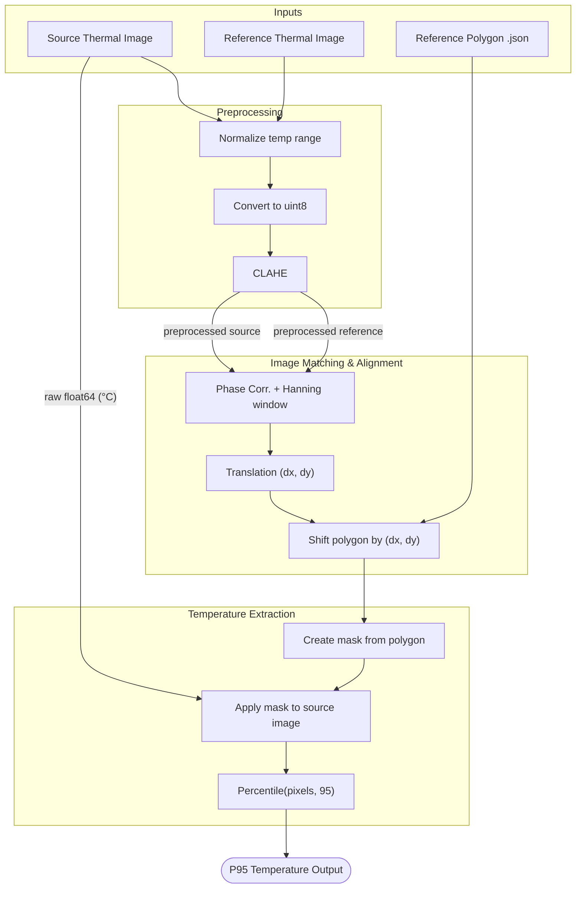

# SARA Thermal Reading

The **SARA Thermal Reading** provides an automated process to get the temerature in a chosen polygon in a thermal image.

## Dependencies

The dependencies used for this package are listed in `pyproject.toml` and pinned in `uv.lock`. This ensures our builds are predictable and deterministic. This project uses [uv](https://docs.astral.sh/uv/) for dependency management:

```
uv lock
```

To update the dependencies to the latest versions, run:

```
uv lock --upgrade
```

### Setup

For the thermal reading to run, we need a reference image and reference polygon located in a blob store.
Both the image and polygon needs to be stored in a container named `installation_code` and a folder named `tagId_inspectionDescription`. For an example see the saradev, saradevthermalref storage account.

### Install locally

Install with `uv sync --extra dev`

### Run tests

Run tests with `uv run pytest .`

### Example .env.example

```bash
SOURCE_STORAGE_CONNECTION_STRING=DefaultEndpointsProtocol=ht ...
DESTINATION_STORAGE_CONNECTION_STRING=DefaultEndpointsProtocol=ht ...
REFERENCE_STORAGE_CONNECTION_STRING=ht ...

```

## Dev utils

### Create reference polygon

Draw polygon directly on image

```bash
python utils_cli.py create-polygon path/to/image.fff
```

Will by default save to `reference_polygon.json` in the current directory

### Create reference polygon for thermal reference image

Draw polygon on thermal reference image, and save it to blob

```bash
python utils_cli.py create-polygon-cloud blobstorageaccountname "tagId" "inspectiondescription"
```

### Show reference polygon for thermal reference image

Show reference polygon on thermal reference image

```bash
python utils_cli.py show-polygon-cloud blobstorageaccountname "tagId" "inspectiondescription"
```

### Plot reference polygon local files

```bash
python utils_cli.py plot-fff path/to/image.fff --polygon-json-path path/to/reference_polygon.json
```

### Plot cloud reference polygon

```bash
python utils_cli.py plot-current-reference-image-and-polygon \
    --installation-code "hua" --tag-id testtag --inspection-description testdesc
```

### Run local fff workflow with example data

```bash
python utils_cli.py run-fff-workflow --polygon-path example-data/polygon.json --reference-image-path example-data/thermal_image.fff
```

## Pipeline Diagram


